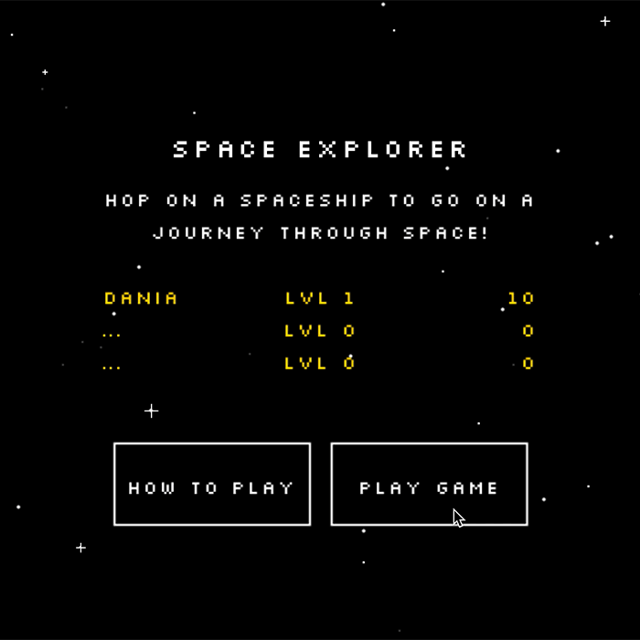

# Space Explorer
A light-hearted space adventure game inspired by 8-bit arcade games.

# Instructions
Move your mouse to control your spaceship, but watch out from the incoming meteors! Collect stars to boost your score, and  hearts to heal from damage! The highest three scores will appear on the scoreboard!

## Installation
- Download this repository.
- Download Processing [here](https://processing.org/download/). 
- Open SpaceExplorer.pde and hit "Run".
- Have fun!
